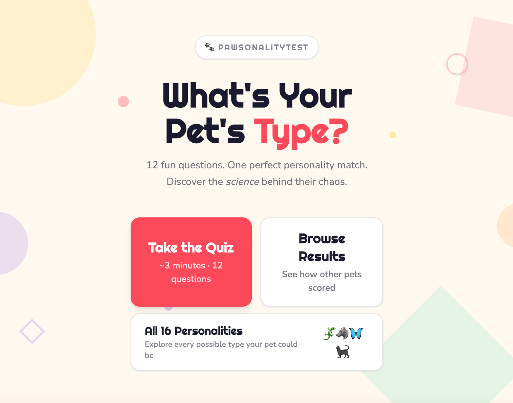

# 🐾 Pawsonality
Pawsonality is a React web application that helps pet owners discover their pet's personality through an interactive questionnaire.

🌐 Live Demo: https://www.petpersonality.org/

## Preview

## Features
- Interactive personality quiz
- Personalized results
- Responsive UI

## Tech Stack
Frontend
- React
- TypeScript
- Vite
- HTML
- CSS

## My Contributions
- Developed the Browse Results page for exploring pet personality profiles.
- Implemented browse functionality to improve navigation and discovery of pet profiles.
- Designed and implemented the Pet Information page to display detailed information for each pet.
- Added intuitive back navigation to improve the overall user experience.

## Team
Developed as a team project for the User Experience Design (CIS 4930) course.
